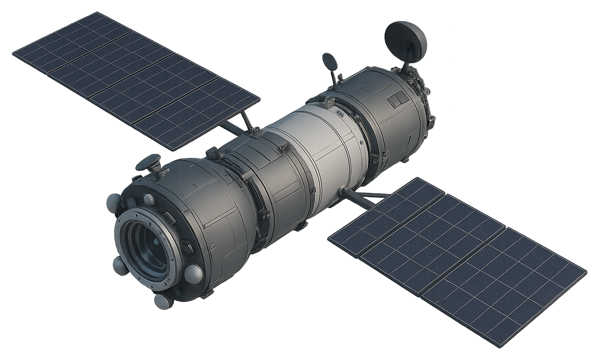

<p align="center">
  
</p>

# spaceOS

[](https://www.patreon.com/lozoya)
[](https://www.buymeacoffee.com/clozoya172b)
[](https://ko-fi.com/lozoya)


**Spacecraft Flight Software Operating System**


A lightweight flight software operating system in C for spacecraft avionics and payload controllers.  
This project is focused on building a certifiable, space-grade real-time kernel and supporting flight software services.

---

# Introduction

This project is designed as a generic, extensible operating system that provides a stable core while exposing clear
interfaces to hardware. The operating system defines the overall structure and common services, while the user supplies
the logic that connects those interfaces to specific devices.

A few complete examples are provided to show how typical hardware can be integrated, but the design ensures that modules
can be swapped out or extended without altering the core. Hardware differences are handled entirely through the
interface layer, keeping the system consistent and portable.

The goal is to create a framework-style operating system: stable at its core, adaptable at its boundaries, and capable
of interfacing with any hardware through well-defined extension points.

---

## Scope

Development begins with a single avionics domain to enable fast iteration:

- **Command & Data Handling (C&DH)**  
  Core of flight software.
    - **Telecommand (TC) handling:** parse CCSDS packets, validate, route to subsystems.
    - **Telemetry (TM) generation:** housekeeping, event, and payload telemetry.
    - **Mode control:** boot, safe, detumble, nominal, science.
    - **Fault Detection, Isolation & Recovery (FDIR):** health checks, safing actions.

- **Guidance, Navigation & Control (GNC)**  
  Real-time, safety-critical.
    - **ADCS (Attitude Determination & Control System):** sensors (gyro, mag, sun), actuators (reaction wheels,
      magnetorquers, thrusters).
    - **Orbit propagation and guidance:** target pointing, maneuver execution.
    - **Control laws:** detumble, nadir pointing, sun tracking.

- **Electrical Power System (EPS)**  
  Mission-critical resource management.
    - **Battery monitoring:** voltage, current, temperature.
    - **Solar array control:** deployment, maximum power point tracking.
    - **Power distribution:** switch rails, load shedding, heater control.

- **Thermal & Propulsion Subsystems**
    - **Thermal:** heater cycling, temperature sensors, thermal balance.
    - **Propulsion:** valve control, thruster firings, tank pressure monitoring.

---

## Architecture

Implemented entirely in C. Options under evaluation:

- **Bare-metal RTOS kernel (time-partitioned)**  
  Fixed-priority, deterministic scheduling with static configuration.
- **Cyclic executive (time-triggered)**  
  Precomputed major/minor cycles; ultra-predictable, simple certification.
- **Microkernel with MPU protection**  
  Task isolation across C&DH, GNC, EPS tasks.
- **CCSDS-based middleware**  
  Space industry standard packet formats and service layers.

---

## Kernel Feature Set

- **Scheduling:** Fixed-priority or cyclic; tickless support.
- **Interrupts:** Low-latency ISRs, deferred execution.
- **Synchronization:** Mutexes with priority inheritance, event flags, message queues.
- **Memory:** Static-only allocation, no heap post-init; MPU regions per subsystem task.
- **Timing:** Mission Elapsed Time (MET), CCSDS-compatible time services.

---

## Platform Services

### Communication

- SpaceWire, CAN, RS-422/485, UART.
- CCSDS TC/TM, packet building/parsing.
- Redundancy switching for dual transceivers.

### Diagnostics & Health

- Watchdog timers, brown-out detection, FDIR, safing logic.
- Event logging, telemetry reporting.

### Storage

- Journaling flash manager, onboard file system, black-box logging.

### Security

- Secure boot, image verification, crypto HAL, telecommand authentication.

### Updates

- Dual-bank flight software images, rollback on failure, authenticated uploads.

### Time

- MET counter, GPS time sync, CCSDS time encoding/decoding.

---

## Safety & Process

- **ECSS / NASA standards:** Flight software process compliance, hazard analysis.
- **Coding Standard:** MISRA C:2012; strict deterministic execution.
- **Static Analysis:** PC-lint, Coverity, Cppcheck.
- **Timing Analysis:** Worst-case execution time budgeted per task.
- **Verification & Validation:** SIL, PIL, HIL with spacecraft simulators, fault injection.

---

## Hardware Targets

- **Preferred processors/MCUs:** LEON (SPARC V8), ARM Cortex-M/R with ECC, RISC-V space-hardened.
- **Desired features:** Radiation tolerance, dual-redundant comms, watchdogs, hardware timers, SpaceWire interface.

---

## Deliverables (Phased)

- **Phase 0 – Board Bring-up**  
  BSP: clock tree, interrupts, startup.s, linker script, UART/RS-422.
- **Phase 1 – Kernel**  
  Scheduler, task control blocks, mutexes, timers, events.
- **Phase 2 – Comms**  
  CCSDS packet handlers, SpaceWire stack, TC/TM routing.
- **Phase 3 – Subsystem Interfaces**  
  EPS drivers, ADCS sensors/actuators, propulsion valves, thermal sensors.
- **Phase 4 – Safety & FDIR**  
  Watchdogs, safing mode, event telemetry, brown-out handling.
- **Phase 5 – Payload & Operations**  
  Science data flows, command sequencing, autonomous scripts.

---

## Toolchain & CI

- **Compiler:** GCC cross-toolchains (sparc-elf, arm-none-eabi), vendor compilers.
- **Build System:** Make or CMake; outputs: ELF + map + size + telemetry dictionary.
- **CI:** Static analysis, unit tests (Ceedling/Unity), code coverage, simulation-in-the-loop.
- **Tracing & Logging:** Event logging, CCSDS time-tagged binary traces.

---

## Design Guidelines

- Keep ISR work minimal; use event/task handoff.
- No malloc/free after init; static buffers only.
- Validate all telecommands and packet lengths.
- Deadline monitors on periodic tasks; trigger safing on overrun.
- Separate configuration tables from kernel/service code.

---

## First Milestone

- Kernel bring-up with 3 priority levels.
- CCSDS TC loopback test: inject packet, route, reply with TM.
- Watchdog serviced by background task; force reset on overrun.
- Event telemetry logging to file system; prove persistence under reset.

---

# Acronym Glossary

| Acronym | Definition                                              |
|---------|---------------------------------------------------------|
| ADCS    | Attitude Determination and Control System               |
| C&DH    | Command & Data Handling                                 |
| CCSDS   | Consultative Committee for Space Data Systems           |
| CI      | Continuous Integration                                  |
| EPS     | Electrical Power System                                 |
| FDIR    | Fault Detection, Isolation, and Recovery                |
| GNC     | Guidance, Navigation, and Control                       |
| HIL     | Hardware-in-the-Loop                                    |
| ISR     | Interrupt Service Routine                               |
| MET     | Mission Elapsed Time                                    |
| MISRA C | Motor Industry Software Reliability Association C rules |
| MPU     | Memory Protection Unit                                  |
| OBC     | On-Board Computer                                       |
| PIL     | Processor-in-the-Loop                                   |
| RTOS    | Real-Time Operating System                              |
| SIL     | Software-in-the-Loop                                    |
| SPW     | SpaceWire                                               |
| TC/TM   | Telecommand / Telemetry                                 |

---

# Project Structure

```text
spacecraft-os-c/
├─ app/ # application tasks and modes
│ ├─ app_main.c
│ ├─ app_tasks.c/h
│ ├─ app_modes.c/h
│ ├─ app_cmd.c/h
│ └─ app_tlm.c/h
├─ fsw/
│ ├─ kernel/ # real-time kernel
│ │ ├─ os_kernel.c/h
│ │ ├─ os_sched.c/h
│ │ ├─ os_task.c/h
│ │ ├─ os_mutex.c/h
│ │ ├─ os_event.c/h
│ │ ├─ os_queue.c/h
│ │ ├─ os_timer.c/h
│ │ └─ os_isr.c/h
│ └─ config/
│ ├─ os_config.h
│ ├─ board.h
│ ├─ toolchain.h
│ ├─ linker.ld
│ └─ startup.s
├─ platform/
│ ├─ bsp/
│ │ ├─ bsp_init.c/h
│ │ ├─ clocks.c/h
│ │ ├─ mpu.c/h
│ │ └─ interrupts.c/h
│ ├─ drivers/
│ │ ├─ uart.c/h rs422.c/h can.c/h
│ │ ├─ spi.c/h i2c.c/h spacewire.c/h
│ │ ├─ sd.c/h flash.c/h gpio.c/h
│ │ ├─ adc.c/h dac.c/h timer.c/h
│ │ └─ watchdog.c/h
│ └─ time/
│ ├─ met.c/h
│ └─ ccsds_time.c/h
├─ comms/
│ ├─ ccsds/
│ │ ├─ ccsds_pkt.c/h tc_parser.c/h tm_builder.c/h
│ ├─ spacewire/
│ │ ├─ spw_stack.c/h
│ └─ can/
│ ├─ can_stack.c/h
├─ fdir/
│ ├─ fdir.c/h
│ └─ safing.c/h
├─ gnc/
│ ├─ attitude/ (adcs_if.c/h estimator.c/h control.c/h)
│ ├─ navigation/ (propagator.c/h orbit.c/h)
│ └─ guidance/ (guidance.c/h)
├─ subsystems/
│ ├─ eps/ (power.c/h battery.c/h solar.c/h pmic.c/h)
│ ├─ thermal/ (thermal.c/h)
│ ├─ propulsion/ (thrusters.c/h tanks.c/h valve.c/h)
│ └─ payload/ (payload_mgr.c/h)
├─ storage/
│ ├─ fs/ (fs.c/h)
│ ├─ nv_journal.c/h
│ └─ logging/ (log.c/h)
├─ security/
│ ├─ secure_boot.c/h
│ └─ crypto_hal.c/h
├─ tests/
│ ├─ unit/
│ └─ hil/
├─ tools/
│ └─ scripts/
├─ docs/
│ ├─ STRUCTURE.md
│ ├─ CODING.md
│ ├─ SAFETY.md
│ └─ CCSDS.md
├─ build/
└─ Makefile
```

---

## Support This Work

Open source engineering takes a lot of time and coffee. If you would like to directly support ongoing research, development, and maintenance of these tools, you can do so here:

[](https://www.patreon.com/lozoya)

[](https://www.buymeacoffee.com/clozoya172b)

[](https://ko-fi.com/lozoya)

Your support helps keep the project healthy and moving forward.

---

## License

This project is licensed under the GNU Affero General Public License v3.0 (AGPL-3.0). Any modified version made available to users over a network must also be released under the AGPL-3.0. See the LICENSE file for full details.


---


